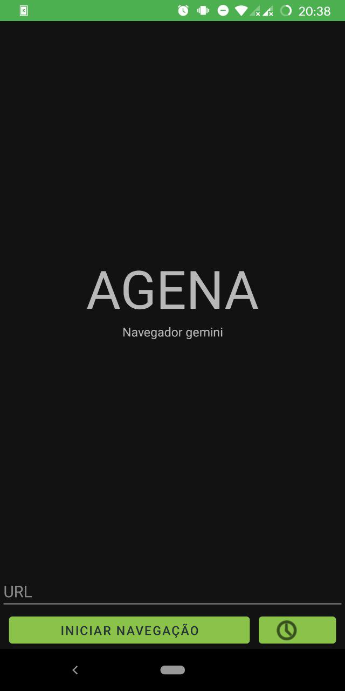
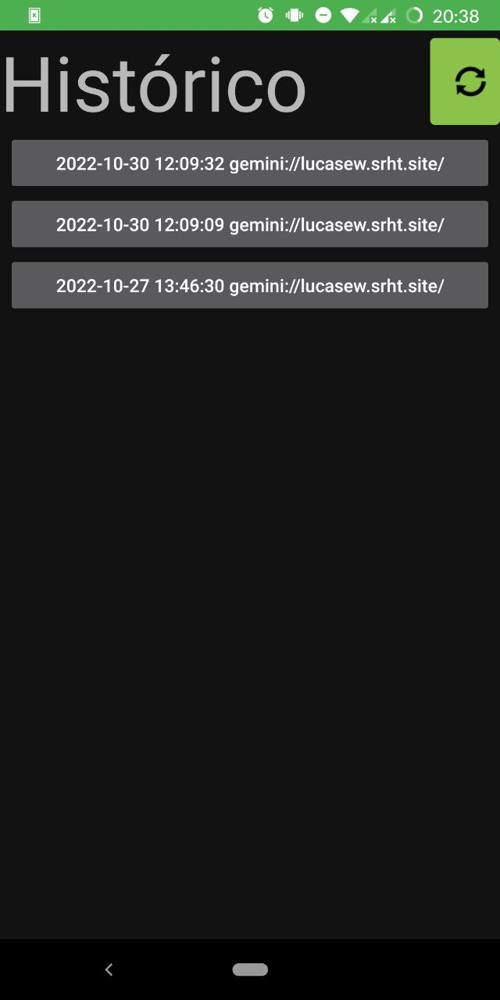
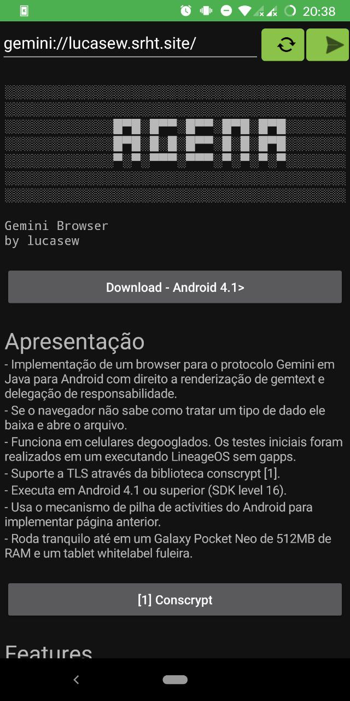

    </img>

[Download](https://github.com/lucasew/agena) (>Android 4.1)

* Gemini browser implementation made in Java for Android that can render gemtext as native components.
* If the browser can't handle a data type it downloads and opens the file.
* Works in degoogled phones. The initial tests were in a Galaxy S4 with LineageOS without gapps.
* TLS support with [conscrypt](https://github.com/google/conscrypt).
* Works with Android 4.1 (SDK level 16) or superior.
* It uses the Android's activity stack to implement previous page.
* Works fine and fast even on a 512MB Galaxy Pocket Neo and a very slow whitelabel tablet.
* Allows seeing the full stacktrace if it finds an unhandled error.
* Comprehensive test suite with automated CI/CD testing.

# Features
* Images
* Big texts
* Hyperlinks rendered as buttons with deeplink support
* Gemlog access
* Headings
* Lists

# Protocol Compliance

✅ **Fully compliant with the Gemini Protocol Specification**

- ✅ All status codes (10-69) implemented
- ✅ Input prompts (10-11) with dialog support
- ✅ Redirect limit (max 5)
- ✅ URI validation (1024 byte limit)
- ✅ TLS 1.2+ with SNI support
- ✅ Certificate error handling (60-69)
- ✅ Comprehensive error messages

# TODO
- [ ] Full TOFU certificate persistence
- [ ] Client certificate generation and management

# Screenshots

